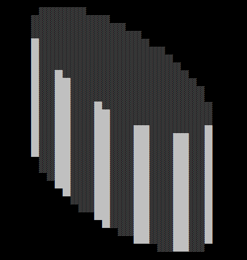
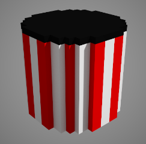

# VoxFile
Load and access MagicaVoxel model files (.vox) through a simple, clean interface.

The code is just a single header and source file with no dependencies. You can include them in your project directly.

Quick example:
```
  VoxFile voxFile(true, true);         // The parameters indicate to load models as both dense and sparse (see below)
  voxFile.Load("cylinder-thing.vox)");
  
  const VoxDenseModel& denseModel = voxFile.denseModels().at(0);   // 3D array of voxels
  const VoxSparseModel& sparseModel = voxFile.sparseModels().at(0); // List of non-empty voxels
  
  cout << "Color index at x=0, y=2, z=4 is: " << denseModel.voxel(0, 2, 4) << endl;
  cout << "There are " << sparseModel.voxels().size() << " voxels in the first model." << endl;
```

The color palette is also available:
```
  const Color& color = denseModel.palette().at(10);
  cout << "RGBA of color 10 is: " << color.r << ',' << color.g << ',' << color.b << ',' << color.a << endl;
```

And since everyone needs a console voxel ray tracer with skew-orthogonal 3D graphics, here's a full example:

```
#include "vox_file.h"
#include<iostream>

using namespace std;
using namespace magicavoxel;

char rgbaToChar(const magicavoxel::Color& color)
{
  static const int n_intensity_levels = 4;
  static const std::array<char, n_intensity_levels> intensity_char{'°', '±', '²', 'Û'};

  int intensity = (77 * color.r + 151 * color.g + 28 * color.b) /
                  (256 * 255 / (n_intensity_levels-1)) + 1;
  return intensity_char.at(intensity);
}

int main()
{
  static const int kPixelWidth = 2;

  VoxFile voxFile(true);
  voxFile.Load(R"(C:\code\games\resources\MagicaVoxel\cylinder-thing.vox)");

  for (const auto& model : voxFile.denseModels()) {
    cout << endl;
    const Size& size = model.size();
    for (int sy = 0; sy < size.z + size.y - 1; ++sy) {
      for (int sx = 0; sx < size.x + size.y - 1; ++sx) {
        //Vec3i ray{-size.x + 1, 0, size.z - 1 + size.y - 1};
        int ray_x = -static_cast<int>(size.y) + 1 + sx;
        int ray_y = 0;
        int ray_z = static_cast<int>(size.z) - 1 + static_cast<int>(size.y) - 1 - sy;
        while (ray_y < size.y) {
          if (ray_x >= 0 && ray_x < size.x &&
              ray_y >= 0 && ray_y < size.y &&
              ray_z >= 0 && ray_z < size.z) {
            const uint8_t color_idx = model.voxel(ray_y, ray_x, ray_z);
            if (color_idx) {
              cout << string(kPixelWidth, rgbaToChar(model.palette().at(color_idx)));
              break;
            }
          }
          ++ray_y;
          ++ray_x;
          --ray_z;
        }
        if (ray_y == static_cast<int>(size.y)) cout << string(kPixelWidth, ' ');
      }
      cout << endl;
    }
  }
  return 0;
}
```



Original model:


Hey no worries, you have all of the data needed to do better than a lousy console renderer. 
